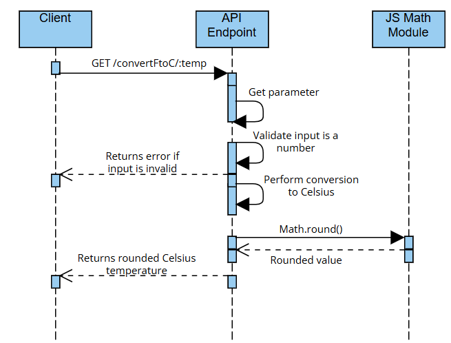

HOW TO REQUEST DATA
- Clone this repo & navigate to the directory on your machine.
- Run 'npm install express' in order to install Express, which is required to request data.
- Run the server file in a terminal window by running 'node .\temperature-converter.js'
- In your code, make a fetch to http://localhost:5000/convertFtoC/${sampleTemp}, where the ${sampleTemp} is either a hard-coded temperature integer or an inline variable that you set.

HOW TO RECEIVE DATA
- Data is returned as a JSON object with one key/value pair. The key is "celsius" and the value is the converted temperature.
- To access the returned data, capture the JSON response (as in the sample call below) and assign to a variable.
- The temperature can then be used by accessing the key "celsius" for whatever variable you've set the return object to (see sample call below).

Sample call: 
let sampleTemp = 71

fetch(`http://localhost:5000/convertFtoC/${sampleTemp}`) // URL with programmatic parameter
  .then(response => {
    if (!response.ok) {
      console.error(`HTTP error: ${response.status}`);
    }
    return response.json();
  })
  .then((data) => {
    // Do whatever you want with the data - you can assign it to a var, log it, etc.
    console.log(data);
  })
  .catch((err) => {
    console.error(err);
  });

UML DIAGRAM

